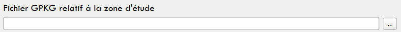
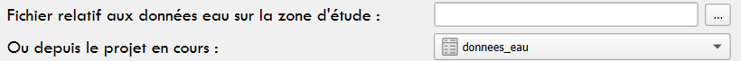
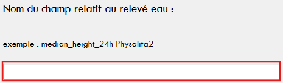
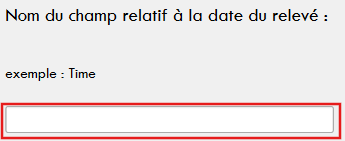
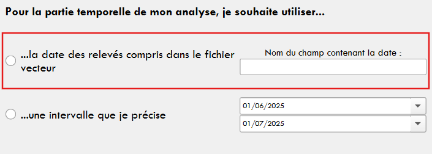
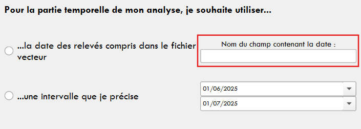
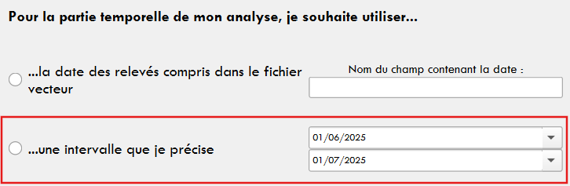
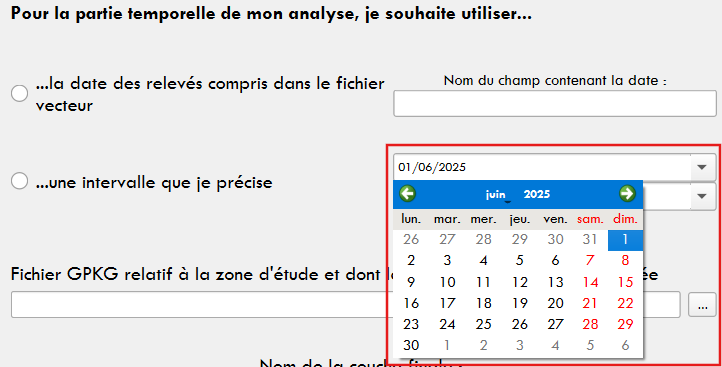
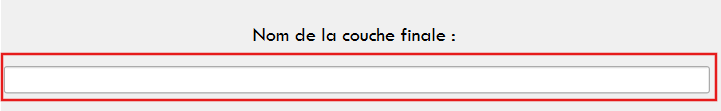
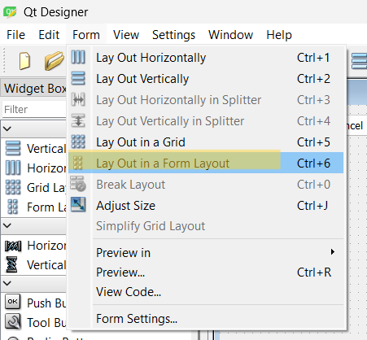

# 
Documentation - Plugin Top'Eau   

# Sommaire

- [Installation du Plugin](#installation-du-plugin)
- [Présentation du Plugin Top'Eau](#présentation-du-plugin-topeau)
  - [Genèse du Plugin](#genèse-du-plugin)
  - [Quels utilisateurs?](#quels-utilisateurs)
  - [Structuration du Plugin](#structuration-du-plugin)
- [Utilisation](#utilisation)
  - [Simulation de niveaux d'eau au sein d'une zone d'étude](#simulation-de-niveaux-deau-au-sein-dune-zone-détude)
    - [Données et variables en entrée](#données-et-variables-en-entrée)
    - [Données en sortie](#données-en-sortie)
	- [Avertissement](#avertissement)
  - [Import de données eau à la base de données SQLite](#import-de-données-eau-à-la-base-de-données-sqlite)
    - [Données en entrée](#données-en-entrée)
    - [Données en sortie](#données-en-sortie-1)
  - [Analyse biodiversité](#analyse-biodiversité)
    - [Données en entrée](#données-en-entrée-1)
    - [Données en sortie](#données-en-sortie-2)
  - [Indicateurs et variables hydriques](#indicateurs-et-variables-hydriques)
    - [Données en entrée](#données-en-entrée-2)
    - [Données en sortie](#données-en-sortie-3)
  - [Aspect technique](#aspect-technique)
    - [Langages](#langages)
    - [Arborescence et fichiers de code](#arborescence-et-fichiers-de-code)
    - [Modules Python](#modules-python)
	- [Fichiers PY (Fichiers de code, algorithmes)](#fichiers-py-fichiers-de-code-algorithmes)
	- [Fichiers UI (Interfaces QT)](#fichiers-ui-interfaces-qt)
	- [Fichiers QML (Fichiers de style)](#fichiers-qml-fichiers-de-style)
- [Annexes](#annexes)
  - [Collaborateurs](#collaborateurs)
  - [Construction du Plugin](#construction-du-plugin)
  - [Sources](#sources)
    - [Sitographie](#sitographie)
    - [Rôle de l'IA](#rôle-de-lia)

## Installation du Plugin

Pour installer le Plugin depuis GitHub : 
 
1. télécharger le ZIP des fichiers de code
 
2. dézipper le dossier "topeau-master" et renommer en "topeau"
 
3. déposer le dossier "topeau" en suivant ce chemin : 
 
> Disque local C:
	> Utilisateurs
		> sélection du dossier utilisateur
			> AppData
				> Roaming
					> QGIS > QGIS3 > profiles > default
						> python
							> plugins
								> déposer dossier topeau avec les autres dossiers plugins
 
4. si QGIS ouvert : fermer la fenêtre et relancer
 
5. Aller dans le Menu "Extensions" et sélectionner "Installer/Gérer les extensions" 
> Taper "Top'Eau" dans la barre de recherche et cliquer sur "Installer"

## En cas de problème

Si l'extension ne se lance pas ou que QGIS renvoie une erreur :
1. vérifier que l'utilisateur possède une version ultérieure à QGIS 3.30 (incompatibilité entre le code actuel et les codes Python des algorithmes QGIS issus des versions antérieures à la 3.30)
 
2. l'entête des fichiers de code présente une installation des modules qui demandent à être installés dans un environnement Python. Malgré tout, il est possible que certains messages d'erreurs apparaissent, comme "module xxx could not be found / no module named xxx" (si le message d'erreur ne s'affiche pas dans une fenêtre QGIS, vérifier la console Python de QGIS). En ce sens, l'utilisateur est prié d'ouvrir OSGEO4W Shell (automatiquement installé avec QGIS) et d'écrire "-m pip install xxx"
 
3. si d'autres problèmes apparaissent, ou que le Plugin ne fonctionne pas et que les messages d'erreur sont trop complexes à gérer pour l'utilisateur, contacter marion.bleuse8@gmail.com

## Présentation du Plugin Top'Eau

### Genèse du Plugin

 Dans le cadre de la Licence Professionnelle Topographie, Cartographie et Système d’Information Géographique (SIG), chaque étudiant est tenu, à l’issue des cours, de suivre un stage de 4 à 5 mois, afin de l’encourager à mettre en application au sein du milieu professionnel les connaissances et compétences acquises en cours, tout en lui permettant de bénéficier d’une insertion dans le monde professionnel. Pour mon stage, j’ai eu l’opportunité d’être encadrée par Mr <strong>Frédéric Pouget</strong> au sein de l’Université, et d’être accueillie par Mr <strong>Julien Ancelin</strong> au sein de l’Unité Expérimentale (UE) de Saint-Laurent-de-la-Prée (SLP), de l’Institut National de Recherche pour l’Agriculture, l’alimentation et l’Environnement (INRAE). Ce stage a été effectué dans le cadre des Volets de Recherche (VR) 1 et 2 du Projet MAVI, et s’est tenu du 14 avril 2025 au 22 août 2025. Le stage comportait trois grandes missions très techniques et utiles au sein de l’Unité et au sein du réseau d’UE créé autour des marais atlantiques. La première mission consistait à créer un MNT exploitable sur le site de Saint-Laurent-de-la-Prée et à comparer différentes sources de données altimétriques pour dresser un référentiel à l’échelle du Projet MAVI. La deuxième mission se concentrait autour de la création automatique d’un référentiel raster et attributaire lié à la simulation de niveaux d’eau dans chacune des parcelles des 5 sites. La troisième mission se tournait vers la création d’un outil permettant l’automatisation de calculs liés aux niveaux d’eau relevés dans les parcelles et fossés adjacents et aux dates de saisie. Puisque les deux et troisième missions se rejoignaient sur le principe de l’automatisation du processus, et de possibilité d’étendre à l’échelle de tous les sites du Projet MAVI, il a été décidé de créer un outil concentrant les deux processus.

Le premier effort de recherche concernant l’automatisation s’est porté vers la création d’un Modeleur graphique QGIS, mais passer par un Modeleur s’est avéré moins efficace que prévu. En ce sens, au fur et à mesure des discussions avec <strong>Julien Ancelin</strong> et <strong>Lilia Mzali</strong>, il a été décidé de mettre en place un Plugin QGIS, codé en Python, avec plusieurs interfaces dédiées à chacune des étapes de l’analyse des données eau relevées par les bouées, les piézomètres ou les agents sur le terrain. Ces étapes comprennent, comme il sera détaillé en allant dans la notice, la création d’un GeoPackage contenant des informations raster et attributaires propres à chaque simulation de niveau d’eau dans une zone d’étude, l’import des données eau dans ces GeoPackage et les analyses. Pour satisfaire un plus grand nombre d’utilisateurs et de demandes, deux interfaces d’analyse ont été réalisées : une propre à l’écoute biodiversité, et une propre à la création d’indicateurs dédiés à la gestion de l’eau. 

Ces analyses ont été jugées comme nécessitant une forme d’automatisation car elles se doivent d’être répétées en fonction des espèces étudiées, des périodes de l’année, des différents types de relevés… et les calculs seraient longs et plus complexes sans ce Plugin et surtout sans la préparation des données proposée par le Plugin. Ces analyses sont effectuées dans le cadre du Projet MAVI mis en place par l’INRAE. Le Plugin a en ce sens vocation à pouvoir effectuer rapidement des traitements sur les différents sites expérimentaux du Projet MAVI, sans se préoccuper de la latence impliquée dans la distance entre les serveurs.

La demande à l’origine du Plugin était celle-ci : “proposer un outil géographique capable de calculer les variables clefs sur l’inondation/assèchement des parcelles en fonction des données de hauteur d’eau acquises, de la topographie et des liens entre la parcelle et les canaux, et d’avoir une lecture visuelle. [...] proposer un outil capable de quantifier les volumes d’eau dans les canaux et sur les parcelles en fonction des hauteurs d’eau enregistrées.” (<i>Proposition de stage de Master 1 / Licence Pro - année 2024-2025</i>, soumise par <strong>Julien Ancelin</strong> auprès de <strong>Frédéric Pouget</strong>). Au fur et à mesure de la définition des besoins et objectifs, il a été convenu de répondre à ces demandes en créant un Plugin avec de multiples interfaces dédiées à la création d’une bibliothèque raster et attributaire permettant de visualiser l’inondation des parcelles et de connaître les surfaces et volumes d’inondation en fonction de classes, l’import de données terrain et l’analyse de données existantes. 

La construction du Plugin s’est reposée sur de nombreuses discussions avec les membres de l’UE qui seraient les premiers utilisateurs (<strong>Lilia Mzali</strong>, <strong>Vincent Boutifard</strong> et <strong>Isis Binam</strong>), et <strong>Julien Ancelin</strong>, qui a encadré toute la partie technique et faisabilité de la solution. 

### Quels utilisateurs?

Ce Plugin s’adresse premièrement aux membres de l’Unité Expérimentale de Saint-Laurent-de-la-Prée, qui ont été interrogés en tant que futurs utilisateurs pour définir les fonctionnalités du Plugin. Il s’agit même plus précisément de fonctionnalités jugées comme utiles, voire nécessaires à automatiser, dans le cadre des études réalisées au sein du Projet MAVI, sous la coordination de <strong>Lilia Mzali</strong> et <strong>Vincent Boutifard</strong>. 

Malgré tout, ce Plugin Open Source a été conçu pour être partagé à plus large échelle. L’utilisation de variables utilisateurs a été privilégiée sur la plupart des entrées afin de permettre à cette extension de devenir un outil utile au plus grand nombre dès qu’il s’agit de gestion des zones hydriques et d’analyser les relations entre la biodiversité et les niveaux d’eau. Évidemment, compte tenu de la précision des calculs effectués, l’extension reste bien plus adaptée à des milieux caractérisés par leur micro-topographie, comme les marais. 

### Structuration du Plugin

Le Plugin a été pensé selon une logique de séparation des étapes de l'analyse et des besoins des utilisateurs en interfaces. Ainsi, deux étapes sont nécessaires avant l'analyse et le calcul d'indicateurs : la création d'une base de données SQLite au format GPKG et l'import des données terrain à analyser. 

## Utilisation

### Simulation de niveaux d'eau au sein d'une zone d'étude

Métiers concernés : gestion de l'eau, gestion de la biodiversité, 

#### Données et variables en entrée

<strong>Les données</strong>

1. Fichier raster relatif à l'élévation du terrain

2. Fichier vecteur relatif à la délimitation à la zone d'étude

<strong>Les variables</strong>

1. Le nom de la zone d'étude

Le nom donné à la zone d’étude est optionnel mais reste très important. En effet, c’est cette valeur qui vient <strong>nommer les fichiers créés</strong> et qui va permettre à l’utilisateur de bien différencier les données produites. De même, le nom donné à la zone d’étude est <strong>intégré aux métadonnées</strong>. Il est également important pour l’utilisateur de noter qu’il ne peut pas générer deux données au même endroit avec le même nom.

2. La valeur minimale 

Il s’agit de savoir <strong>à partir de quelle hauteur d’eau</strong> la génération doit s’effectuer. L’utilisateur peut soit choisir de récupérer le point le plus bas dans la parcelle…

…soit de définir lui-même la hauteur minimale de génération.

3. La valeur maximale à simuler pour l'étude

Il s’agit de savoir <strong>jusqu’à quelle hauteur d’eau</strong> la génération doit s’effectuer. 

4. La résolution

<table>
	<tr>
		<td width="30%"></td>
		<td width="70%">
			
Une dimension technique importante à prendre en compte lors de l'utilisation du Plugin est la <strong>résolution du raster généré</strong>, et surtout du raster en entrée. En effet, il n'est pas dérangeant de générer un raster avec une trop grosse résolution, mais générer un raster avec une résolution trop basse (donc plus basse que la donnée en entrée) renvoie une donnée inutilisable et impossible à visualiser, sans pour autant renvoyer de message d'erreur à l'utilisateur. Il est donc essentiel que l'utilisateur connaisse la résolution du raster qu'il donne en entrée au Plugin. Pour les référentiels altimétriques les plus couramment utilisés, la résolution est indiquée ci-contre.

			
		</td>
	</tr>
</table>

5. Le pas de génération

Il s’agit là de savoir quelle <strong>distance du niveau d’eau simulé dans la parcelle va séparer chaque donnée générée</strong>. Le pas par défaut est de 0,01 mètre, soit 1 centimètre, et permet donc de générer un raster tous les centimètres, afin d’avoir accès à une base de données large et précise pour pouvoir effectuer une comparaison avec les relevés effectués sur le terrain.

#### Données en sortie

 La donnée produite par le Plugin est un GeoPackage qui sert de base de données gérée en SQL et qui stocke un ensemble de données de types et de formats différents. Il s'agit d'un ensemble de rasters, vecteurs et tables, créés et implémentés automatiquement. 

 Les données sont les suivantes :  

<table>
	<tr>
		<td width="30%"></td>
		<td width="70%">
			

			<li> un raster par niveau d'eau généré (1) </li>
			<li> une couche vecteur "zone_etude" contenant la géométrie et les attributs de la zone d’étude (2) </li>
			<li> une couche vecteur "hauteur_eau" contenant l’emprise géométrique et les attributs de chaque niveau d’eau généré (3) </li>
			<li> une table “mesure” vide pour l’accueil des données eau à importer ensuite (4) </li>
			<li> deux tables de métadonnées édifiées selon les documents qualité d’Olivier Schmit (5) </li>
			

		</td>
	</tr>
</table>

#### Avertissement

 Il est vraiment important de noter qu'il s'agit là d'une estimation produite en fonction de la donnée altimétrique. Si celle-ci a des défaillances ou des erreurs de correspondance avec le terrain, l'algorithme ne saurait en être tenu responsable. De même, dans le cadre des marais, la donnée produite à partir du Plugin n'est pas en mesure de prendre en compte les connexions ou déconnexions entre les parcelles et les fossés. 

### Import de données eau à la base de données SQLite

#### Données en entrée

En entrée, les données requises sont :
<li> le GPKG créé précédemment 
 

</li>
<li> un fichier .csv contenant les relevés eau 
 

L'interface permet à l'utilisateur de renseigner les champs contenant les informations demandées : 
 
1. le champ contenant la date du relevé
 

 
2. le champ contenant le relevé (renseigné avec l'exact même nom)
 

</li>
<strong>L'utilisateur est prié de sélectionner un fichier dont le champ renseignant la date est au format date.</strong>

#### Données en sortie

La seule donnée en sortie est le GPKG initial dont la table "mesure" a été complétée par les relevés fournis.
 
NB : la table peut ne pas être complétée ou peut afficher des valeurs nulles ou vides si : le format date n'est pas valide, le champ renseignant le relevé eau n'a pas été correctement orthographié, ou que le fichier de base contient des valeurs nulles.

### Analyse biodiversité

Métiers concernés : gestion de la biodiversité, ingénieur biodiversité, ingénieur d'études, ingénieur de recherches 

#### Données en entrée

 Comme l'indique l'interface graphique de la partie "Analyse biodiversité", la donnée en entrée doit être un fichier vecteur de type "point" (ou "poncutel"). Celle-ci se doit d'être référencée dans le bon système de coordonnées (celui utilisé par le reste des algorithmes du Plugin est le Lambert 93 [2154]). Selon la méthode utilisée pour la temporalité, la table attributaire se doit d'être complétée.

<strong>L'utilisateur est prié de cocher une des deux options, sous peine de dysfonctionnement de l'algorithme</strong> 

<strong>Méthode 1 : l'analyse temporelle est ponctuelle</strong> 
 

 
Ce choix est réservé aux utilisateurs ayant des relevés ponctuels qu'ils désirent analyser. Le cas d'utilisation ayant servi à l'élaboration de cette étape et à la validation des données produites est celui de relevés terrain liés à l'écoute d'amphibiens. L'utilisateur avait pris sur le terrain des points correspondant à la localisation d'amphibiens, afin d'effectuer des recherches sur la possible corrélation entre l'habitat et la présence/absence de certaines espèces. L'utilisateur souhaitait poursuivre son analyse en cherchant à savoir si une corrélation entre la présence d'amphibiens et la hauteur d'eau dans un espace étudié pouvait être pointée. Ainsi, cette étape de l'analyse devait lui servir pour croiser les données terrain avec les données eau importées précédemment et les rasters créés dans le GeoPackage. Pour ce faire, la donnée en entrée devait <strong>contenir un champ renseignant la date du relevé, et ce dans un format date valide</strong>. C'est le nom de ce champ qui est demandé à l'utilisateur.
 

<strong>Méthode 2 : l'analyse temporelle est soumise à un intervalle</strong> 
 

 
Ce choix est réservé aux utilisateurs ayant des relevés qu'ils désirent analyser. Le cas d'utilisation ayant servi à l'élaboration de cette étape et à la validation des données produites est celui de relevés terrain liés à l'analyse de communautés végétales sur des transects floraux. L'utilisateur avait pris sur le terrain des points correspondant à des quadrats, afin d'analyser la flore contenue dans ces quadrats pour chercher à établir ou réfuter une corrélation entre l'altimétrie, l'inondation ou l'assèchement du terrain et les espèces présentes au sein des communautés. Pour commencer, l'utilisateur désirait connaître le niveau d'eau hypothétique au sein de ses zones détude (alentours d'un transect floral) tout au long de l'année. Ainsi, cette étape de l'analyse devait lui servir pour croiser les données terrain avec les données eau importées précédemment et les rasters créés dans le GeoPackage. Pour ce faire, la donnée en entrée devait <strong>être confrontée à un intervalle (pouvant s'éaler sur plusieurs années)</strong> sélectionné à même l'interface à l'aide du petit calendrier.
 

#### Données en sortie

Peu importe la méthode sélectionnée, la donnée produite par l'algorithme est une couche vecteur ponctuelle <strong>temporaire</strong> ajoutée au projet QGIS en cours et nommée par l'utilisateur.
 

 
<strong>S'il veut enregistrer en local sa donnée, l'utilisateur est prié de sélectionner "Exporter > Sauvegarder l'entité sous..." en effectuant un clic droit sur la couche, ce qui le rend libre de choisir l'emplacement et le format.</strong>

Dans les deux cas, la couche produite reprend les champs de la couche d'entrée, et les valeurs qui leur sont associées. Les champs ajoutés sont les suivants : 

|Champ ajouté        | Signification      |
|--------------------|------------|
| lame_eau           |Soustraction entre le niveau d'eau relevé sur le terrain à la date du relevé biodiversité et la hauteur du terrain pour connaître la lame d'eau (en cm) sous l'individu écouté/dans le quadrat/etc...|
| niveau_eau_cm      |Niveau d'eau relevé sur le terrain et associé à la date du relevé biodiversité dans la table "mesure" converti en cm|

Pour la couche issue de la méthode 1, il y a autant d'entités à id unique que dans la couche vecteur d'origine , et pour la couche issues de la méthode 2, il y a autant d'entités à id unique qu'il y a de d'entités dans la couche vecteur d'origine multipliées par le nombre de jours compris dans l'intervalle fournis (exemple : si la couche vecteur d'origine contient 10 points et que l'intervalle tient sur un mois de 30 jours, il y aura dans la couche finale 300 lignes à id unique). 

### Indicateurs et variables hydriques

Métiers concernés : gestion de l'eau,  

#### Données en entrée

La seule donnée en entrée demandée à l'utilisateur est le GeoPackage précédemment créé et duquel la table "mesure" a été implémentée avec les données eau. Les calculs s'effectueront sur les dates données par l'utilisateur : l'algorithme ne saurait combler les jours où les relevés sont nuls (pouvant aboutir à des calculs nuls s'il y a un trop grand nombre de données nulles par mois ou par période). Malgré tout, l'algorithme se charge d'analyser la date compris dans le champ date, et effectue ainsi les calculs par année. L'utilisateur peut ainsi fournir une table mesure complétée avec des données étalées sur plusieurs années sans problème.

#### Données en sortie

En sortie, l'utilisateur trouve le GeoPackage complété par les tables correspondantes aux calculs effectués. Les tables sont : donnees_journalieres, donnees_mensuelles, donnees_periodiques. Ces couches sont d'ailleurs ajoutées automatiquement au projet QGIS en cours dans un groupe dédié (Top'Eau - Indicateurs calculés). Les champs de ces tables ont été décidés par <strong>Lilia Mzali</strong>. Ces calculs correspondent à des indicateurs érigés autour de la gestion de l'eau par <strong>Lilia Mzali</strong> et <strong>Olivier Gore</strong>. De même, les périodes ont été établies par <strong>Olivier Gore</strong>. 

|Période             | Durée      |
|--------------------|------------|
| été                 |1 juin - 30 septembre|
| automne             |1 octobre - 16 décembre|
| hiver               |16 décembre - 15 mars|
| printemps           |16 mars - 31 mai|

-> Pour les calculs journaliers

|Nom du champ        | Valeur calculée/récupérée     |
|--------------------|------------|
| niveau_eau         | niveau récupérée depuis la table mesure précédemment implémentée |
| point_bas          | premier décile récupéré depuis la table zone_etude créée lors de la première étape |
| surface_en_eau     | surface inondée de la zone d'étude récupérée en fonction du niveau d'eau depuis la table hauteur_eau, en m² |
| surface_sup_10cm   | surface inondée de la zone d'étude récupérée en fonction du niveau d'eau et de l'addition des surfaces des classes 3 à 7 depuis la table hauteur_eau, en m²  |
| stress_hydrique    | niveau_eau - (point_bas - 0,42) (indicateur soumis par Olivier Gore)|
| stress_inondation  | niveau_eau - point_bas |
| pourcentage_inondation  | division de la surface inondée de la zone d'étude en fonction du niveau d'eau (récupérée depuis surface_en_eau) par la surface totale de la zone d'étude (récupérée depuis la zone_etude), dont le résultat est multiplié par 100 pour obtenir un pourcentage |
| pourcentage_inondation_sup_10cm | division de la surface inondée de la zone d'étude en fonction du niveau d'eau (récupérée depuis surface_sup_10cm) par la surface totale de la zone d'étude (récupérée depuis la zone_etude), dont le résultat est multiplié par 100 pour obtenir un pourcentage  |

-> Pour les calculs mensuels

|Nom du champ        | Valeur calculée/récupérée     |
|--------------------|------------|
| annee              | valeur récupérée à l'emplacement de l'année dans le champ date des relevés implémentés dans la table mesure |
| mois               | valeur récupérée à l'emplacement du mois dans le champ date des relevés implémentés dans la table mesure, passée en nom des mois (01 -> janvier) |
| moyenne_surface_eau_m2  | moyenne de toutes les valeurs quotidiennes comprises dans le mois correspondant à la surface inondée de la zone d'étude en fonction du niveau d'eau, en m² |
| moyenne_surface_eau_m2  | moyenne de toutes les valeurs quotidiennes comprises dans le mois correspondant à la surface inondée de la zone d'étude en fonction du niveau d'eau et de l'addition des surfaces des classes 3 à 7, en m² |
| stress_hydrique    | moyenne mensuelle calculée selon les niveaux d'eau compris dans le mois : niveau_eau - (point_bas - 0,42) (indicateur soumis par Olivier Gore)|
| stress_inondation  | moyenne mensuelle calculée selon les niveaux d'eau compris dans le mois : niveau_eau - point_bas |
| pourcentage_inondation  | moyenne mensuelle de la division de la surface inondée de la zone d'étude en fonction des niveaux d'eau relevés dans le mois par la surface totale de la zone d'étude (récupérée depuis la zone_etude), dont le résultat est multiplié par 100 pour obtenir un pourcentage |
| pourcentage_inondation_sup_10cm | moyenne mensuelle de la division de la surface inondée de la zone d'étude en fonction des niveaux d'eau relevés dans le mois et des classes 3 à 7 par la surface totale de la zone d'étude (récupérée depuis la zone_etude), dont le résultat est multiplié par 100 pour obtenir un pourcentage  |
| nbr_jours_sup_point_bas | comptage des jours dans le mois lors desquels le niveau d'eau relevé est supérieur au point bas |
| nbr_jours_sup_point_bas_sup_10cm | comptage des jours dans le mois lors desquels le niveau d'eau relevé est supérieur au point bas auquel 10 cm ont été ajoutés|

-> Pour les calculs périodiques

Les valeurs sont les mêmes que celles calculées/récupérées pour la table de données mensuelles, mais les moyennes et comptages sont effectués en fonction des périodes définies précédemment et non des mois.

### Aspect technique

Métiers concernés : administrateur SIG, technicien SIG, développeur, géomaticien, informaticien,  

#### Langages 

 Le langage utilisé est majoritairement le Python. C'est l'un des deux langages les plus utilisés par QGIS (avec C++) pour construire des traitements. Lorsqu'ils sont récupérés depuis QGIS, les algorithmes sont en Python. En ce sens, j'ai décidé de coder l'intégralité des chaînes de traitements en Python, et d'interagir avec PyQT5 pour faire correspondre les fonctions créées avec le fonctionnement de QGIS. Pour ce qui est des interfaces, celles-ci ont été créées en .ui sur QTDesigner, outil qui permet l'insertion de Widgets QGIS. Les styles sont quant à eux enregistrés en .qml. 

 Les fichiers .py sont ceux écrits en Python et donnant accès aux fonctions permettant les traitemetns effectués par le Plugin. Ces fichiers sont commentés le plus efficacement possible pour que ceux-ci soient repris et/ou modifiés au besoin par la suite. Malgré tout, les commentaires ont été agencés et réduits pour ne pas encombrer les fichiers et multiplier les lignes inutiles. 

#### Arborescence et fichiers de code 

 Les fichiers de code fonctionnent entre eux selon une logique d'appel : le fichier topeau.py (en rouge sur le schéma ci-dessous) per met de structurer l'extension et son interface graphique dans la barre d'outils de QGIS, en créant une liste déroulante d'interfaces numérotées. Chaque étape proposée correspond à un appel de fichier différent (en bleu sur le schéma ci-dessous). Chacun de ces fichiers est lié à un fichier .ui qui construit l'interface graphique de la fenêtre. Pour les étapes au sein desquelles les traitements sont simples et/ou limités, un fichier suffit. Par contre, certaines étapes de l'analyse (comme l'analyse raster) sont bien plus longues et font appel à un grand nombre de fonctions. En ce sens, certaines fonctions ont été regroupées dans des fichiers .py (en vert sur le schéma ci-dessous) qui sont appelés au besoin par les autres fonctions. 

#### Modules Python

 Sur Python, les modules – ou “Packages” en anglais – sont des extensions natives ou à installer au sein de l’environnement qui contiennent des instructions Python donnant accès à un large panel de fonctions que le développeur n’aura pas à coder lui-même. 

| Module             | Utilisation       |
|--------------------|-------------------|
| os                 |“Ce module fournit une façon portable d'utiliser les fonctionnalités dépendantes du système d'exploitation.” (https://docs.python.org) |
| osgeo      | Ce module permet l'accès aux librairies de traitement de données géospatiales comme GDAL ou GRASS |
| json               | Ce module offre la possibilité de manipuler, lire et encoder des données de type JSON |
| datetime           | “Ce module met à disposition des fonctions pour manipuler des dates et des heures. [...] l’efficacité de l’import de ce module est due au formatage et à la manipulation des données résultats” (https://docs.python.org) |
| numpy              | Ce module offre la possibilité de calculer les statistiques (déciles, médiane…) qui n’étaient pas calculées à partir des algorithmes natifs de QGIS |
| rasterio           | Ce module offre un ensemble de fonctionnalités utiles à la lecture de données raster, voire à leur manipulation |
| sqlite3            | Ce module permet la connexion à des bases de données SQLite et le requêtage sur leurs données en SQL |
| pandas             | Ce module permet l'utilisation et la manipulation de données |
| geopandas          | Ce module permet l'utilisation et la manipulation de données géospatiales |
| webbrowser         | Ce module permet l'insertion de liens hypertextes pour accèder à des sites web |
| seaborn         | Ce module permet l'accès à des fonctions de visualisation de données (dont la création de graphiques complexes) |
| matplotlib      | Ce module permet l'accès à des fonctions de visualisation de données (dont la création de graphiques) |
| math      | Ce module donne accès à un grand nombre de fonctions et variables mathématiques permettant de réaliser un grand nombre de calculs mathématiques |

#### Fichier PY (Fichiers de code, algorithmes)

#### Fichiers UI (Interfaces QT)

Les interfaces ont été réalisées sur QtDesigner, outil installé en local automatiquement lors de l'installation de QGIS (au même titre que OSGEO4W Shell par exemple). L'interface permet d'agencer les éléments entre eux assez facilement, et surtout de les renommer pour pouvoir les utiliser plus facilement dans les fichiers de code. En effet, les fichiers .ui sont connectés aux fichiers .py, pour permettre l'interaction entre les interfaces et les algorithmes.
 
Les interfaces ont été construites afin d'être les plus intuitives possibles pour l'utilisateur et <i>responsive</i>, donc adaptées aux différentes tailles d'écran, et pouvant être réduites ou élargies. Pour s'assurer de la lisibilité des interfaces et de leur efficacité pour l'utilsiateur, des contrôles ont été effectués par des futurs utilsiateurs du Plugin et par des utilisateurs de QGIS non liés à l'élaboration du Plugin. Pour être <i>responsive</i>, les interfaces ont dû être construites dans des formulaires de grille. L'agencement des éléments est ainsi contraint à des emplacements prédéfinis.
 

#### Fichiers QML (Fichiers de style)

Pour ce qui est des fichiers de style, ils ont été réalisés sur QGIS en travaillant avec les couches raster, selon des classes définies par <strong>Lilia Mzali</strong> et une palette de couleurs définies par <strong>Julien Ancelin</strong> et vecteur, en suivant les symbologies déjà utilisées par l'Unité Expérimentale de Saint-Laurent-de-la-Prée pour les délimitations de zone d'étude et une symbologie permettant de bien visualiser les MultiPolygon malgré leur superposition pour les hauteurs d'eau. Ce sont des fichiers QML implémentés dans le GeoPackage par défaut au sein du code et pouvant être récupérés/modifiés depuis le dossier "style".

## Annexes

### Collaborateurs

- 
<strong>Julien Ancelin :</strong> encadrement technique, contrôle des modifications et des données produites, participation à l'écriture des fichiers de code

- 
<strong>Romain Monjaret :</strong> aide apportée pour la gestion de certaines erreurs, aide apportée pour la séparation des fichiers de code, ressource en documentation/tutoriels Git, GitHub, Python

- 
<strong>Olivier Schmit :</strong> contrôle des métadonnées

### Sources 

#### Construction du Plugin

La grande majorité des notions Python et les connaissances de base à avoir pour commencer à coder un Plugin QGIS m'ont été enseignées par <strong>Julien Hubert</strong> dans le cadre de la LUPSIG.

#### Sitographie

<strong>Calcul des déciles en Python :</strong>  https://statorials.org/deciles-en-python/ 

<strong>Création/gestion du GeoPackage :</strong>  https://gdal.org/en/stable/drivers/raster/gpkg.html 

<strong>Gestion du style du GeoPackage :</strong>   https://docs.qgis.org/3.34/fr/docs/user_manual/introduction/general_tools.html#layer-definition-file - https://docs.qgis.org/3.34/fr/docs/user_manual/managing_data_source/supported_data.html#id14

<strong>Gestion du SQLite avec Python :</strong>  https://www.expertpython.fr/post/tutoriel-cr%C3%A9er-simplement-une-base-de-donn%C3%A9es-sqlite-avec-python - https://fabloch.github.io/fr/tutos/code/python/sqlite

<strong>Gestion du format date en Python :</strong> https://docs.python.org/fr/3.6/library/datetime.html

<strong>Utilisation de QT Designer :</strong> https://doc.qt.io/qt-6/qtdesigner-manual.html 

<strong>Utilisation du module pandas :</strong> https://pandas.pydata.org/docs/user_guide/index.html

#### Rôle de l'IA

 L’IA a majoritairement été utilisée pour structurer logiquement en Python des morceaux de code que j’écrivais et/ou que je récupérais sur Internet/QGIS et pour déchiffrer des erreurs. En effet, je n’avais jamais codé en Python avant octobre 2024 et je n’ai fait qu’un Plugin avant celui-ci, lequel était de complexité moindre par rapport à celui exploré ici. Pour ce qui est de la génération de code, je dirais que l’IA a servi à 50%, et pour ce qui est de la gestion des erreurs, je dirais que l’IA a servi à 75 voire 80%. 

L’IA utilisée était celle proposée par Julien Ancelin lors de la mise en place des premiers fichiers de code du Plugin ; Claude. Claude.ai est un modèle de langage par intelligence artificielle développé par Anthropic, et il est le plus efficace pour la génération et la correction de bugs en Python. Lors d’une requête, Claude génère sa réponse sous deux panneaux, ce qui le rend effectivement plutôt efficace : un panneau est dédié à la réponse directe de l’IA (explication des bugs/des fonctions générées, étapes à suivre pour résoudre les problèmes/créer des fonctions/agencer des lignes de code…) et un panneau dédié à la génération du code commenté. En ce sens, il m’était souvent utile de fournir l’erreur à Claude, d’attendre sa réponse et de ne regarder que le panneau de réponse, pour comprendre mes erreurs, essayer de les résoudre par moi-même et ne pas trop modifier le code. En effet, l’un des désavantages de l’utilisation de l’IA pour la génération et la correction de codes Python se situe dans la complexité et la longueur non nécessaires des codes fournis par l’IA. Souvent, des fonctions inutiles voire incompatibles avec le reste du code, ou apportant un résultat différent de celui demandé, étaient générées, et il devenait vite nécessaire de bien faire attention à la forme que prenait le code. 
