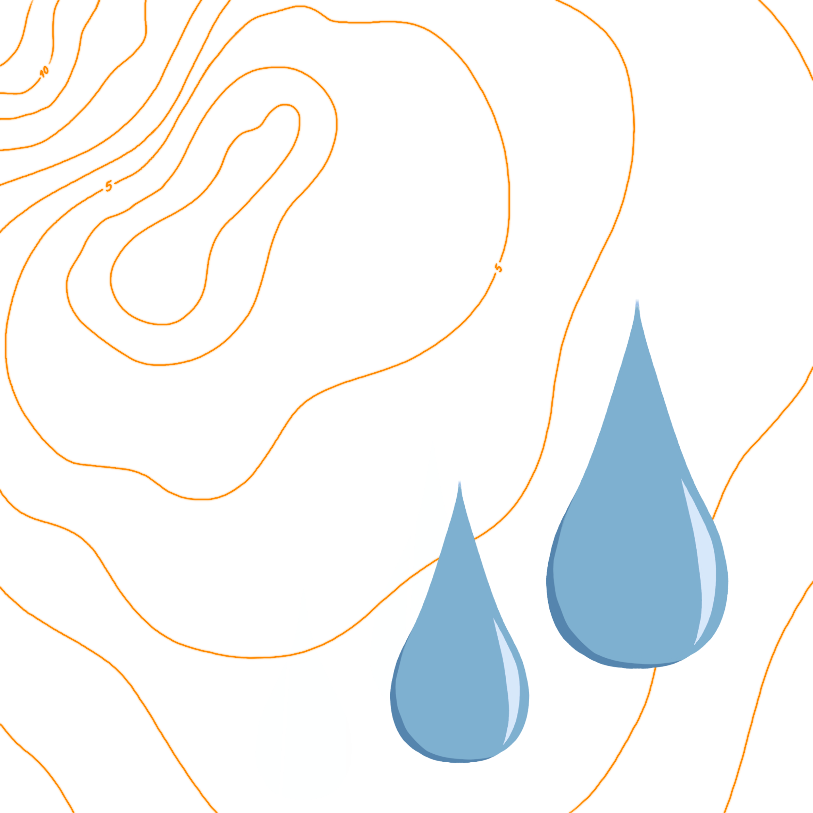
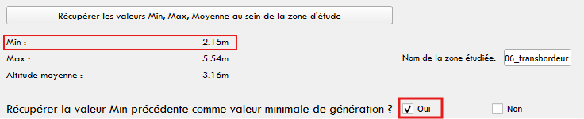
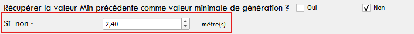
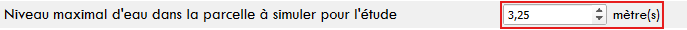
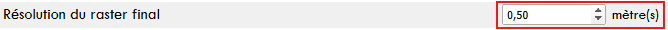
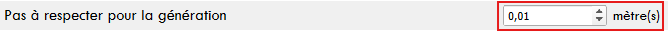
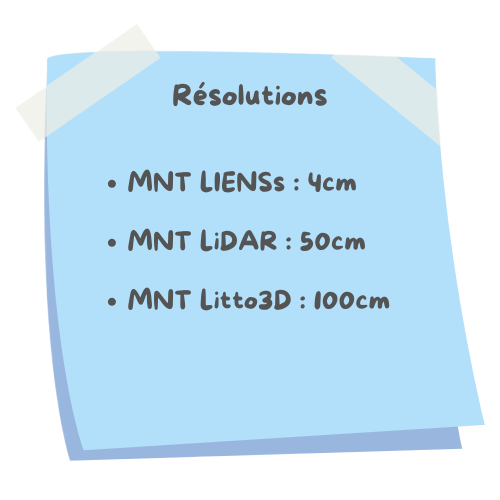
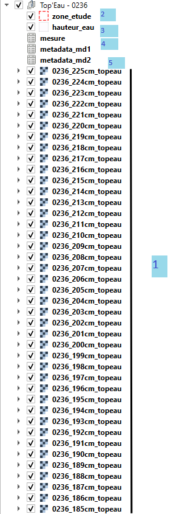
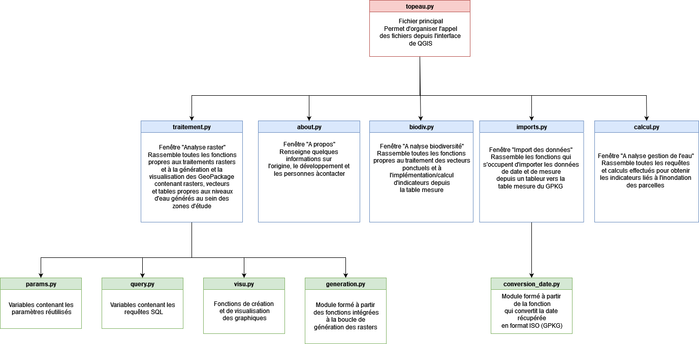

# 
Documentation - Plugin Top'Eau   

# Sommaire

- [Installation du Plugin](#installation-du-plugin)
- [Présentation du Plugin Top'Eau](#présentation-du-plugin-topeau)
  - [Genèse du Plugin](#genèse-du-plugin)
  - [Quels utilisateurs?](#quels-utilisateurs)
  - [Structuration du Plugin](#structuration-du-plugin)
- [Utilisation](#utilisation)
  - [Simulation de niveaux d'eau au sein d'une zone d'étude](#simulation-de-niveaux-deau-au-sein-dune-zone-détude)
    - [Données et variables en entrée](#données-et-variables-en-entrée)
    - [Données en sortie](#données-en-sortie)
	- [Avertissement](#avertissement)
  - [Analyse biodiversité](#analyse-biodiversité)
    - [Données en entrée](#données-en-entrée)
    - [Données en sortie](#données-en-sortie-1)
  - [Indicateurs et variables hydriques](#indicateurs-et-variables-hydriques)
    - [Données en entrée](#données-en-entrée-1)
    - [Données en sortie](#données-en-sortie-2)
  - [Aspect technique](#aspect-technique)
    - [Langages](#langages)
    - [Arborescence et fichiers de code](#arborescence-et-fichiers-de-code)
    - [Modules Python](#modules-python)
- [Annexes](#annexes)
  - [Collaborateurs](#collaborateurs)
  - [Sources](#sources)
    - [Sitographie](#sitographie)
    - [Rôle de l'IA](#rôle-de-lia)

## Installation du Plugin

Pour installer le Plugin depuis GitHub : 
 
1. télécharger le ZIP des fichiers de code
 
2. dézipper le dossier "topeau-master" et renommer en "topeau"
 
3. déposer le dossier "topeau" en suivant ce chemin : 
 
> Disque local C:
	> Utilisateurs
		> sélection du dossier utilisateur
			> AppData
				> Roaming
					> QGIS > QGIS3 > profiles > default
						> python
							> plugins
								> déposer dossier topeau avec les autres dossiers plugins
 
4. si QGIS ouvert : fermer la fenêtre et relancer

## Présentation du Plugin Top'Eau

### Genèse du Plugin

 Dans le cadre de la Licence Professionnelle Topographie, Cartographie et Système d’Information Géographique (SIG), chaque étudiant est tenu, à l’issue des cours, de suivre un stage de 4 à 5 mois, afin de l’encourager à mettre en application au sein du milieu professionnel les connaissances et compétences acquises en cours, tout en lui permettant de bénéficier d’une insertion dans le monde professionnel. Pour mon stage, j’ai eu l’opportunité d’être encadrée par Mr <strong>Frédéric Pouget</strong> au sein de l’Université, et d’être accueillie par Mr <strong>Julien Ancelin</strong> au sein de l’Unité Expérimentale (UE) de Saint-Laurent-de-la-Prée (SLP), de l’Institut National de Recherche pour l’Agriculture, l’alimentation et l’Environnement (INRAE). Ce stage a été effectué dans le cadre des Volets de Recherche (VR) 1 et 2 du Projet MAVI, et s’est tenu du 14 avril 2025 au 22 août 2025. Le stage comportait trois grandes missions très techniques et utiles au sein de l’Unité et au sein du réseau d’UE créé autour des marais atlantiques. La première mission consistait à créer un MNT exploitable sur le site de Saint-Laurent-de-la-Prée et à comparer différentes sources de données altimétriques pour dresser un référentiel à l’échelle du Projet MAVI. La deuxième mission se concentrait autour de la création automatique d’un référentiel raster et attributaire lié à la simulation de niveaux d’eau dans chacune des parcelles des 5 sites. La troisième mission se tournait vers la création d’un outil permettant l’automatisation de calculs liés aux niveaux d’eau relevés dans les parcelles et fossés adjacents et aux dates de saisie. Puisque les deux et troisième missions se rejoignaient sur le principe de l’automatisation du processus, et de possibilité d’étendre à l’échelle de tous les sites du Projet MAVI, il a été décidé de créer un outil concentrant les deux processus.

Le premier effort de recherche concernant l’automatisation s’est porté vers la création d’un Modeleur graphique QGIS, mais passer par un Modeleur s’est avéré moins efficace que prévu. En ce sens, au fur et à mesure des discussions avec <strong>Julien Ancelin</strong> et <strong>Lilia Mzali</strong>, il a été décidé de mettre en place un Plugin QGIS, codé en Python, avec plusieurs interfaces dédiées à chacune des étapes de l’analyse des données eau relevées par les bouées, les piézomètres ou les agents sur le terrain. Ces étapes comprennent, comme il sera détaillé en allant dans la notice, la création d’un GeoPackage contenant des informations raster et attributaires propres à chaque simulation de niveau d’eau dans une zone d’étude, l’import des données eau dans ces GeoPackage et les analyses. Pour satisfaire un plus grand nombre d’utilisateurs et de demandes, deux interfaces d’analyse ont été réalisées : une propre à l’écoute biodiversité, et une propre à la création d’indicateurs dédiés à la gestion de l’eau. 

Ces analyses ont été jugées comme nécessitant une forme d’automatisation car elles se doivent d’être répétées en fonction des espèces étudiées, des périodes de l’année, des différents types de relevés… et les calculs seraient longs et plus complexes sans ce Plugin et surtout sans la préparation des données proposée par le Plugin. Ces analyses sont effectuées dans le cadre du Projet MAVI mis en place par l’INRAE. Le Plugin a en ce sens vocation à pouvoir effectuer rapidement des traitements sur les différents sites expérimentaux du Projet MAVI, sans se préoccuper de la latence impliquée dans la distance entre les serveurs.

La demande à l’origine du Plugin était celle-ci : “proposer un outil géographique capable de calculer les variables clefs sur l’inondation/assèchement des parcelles en fonction des données de hauteur d’eau acquises, de la topographie et des liens entre la parcelle et les canaux, et d’avoir une lecture visuelle. [...] proposer un outil capable de quantifier les volumes d’eau dans les canaux et sur les parcelles en fonction des hauteurs d’eau enregistrées.” (<i>Proposition de stage de Master 1 / Licence Pro - année 2024-2025</i>, soumise par <strong>Julien Ancelin</strong> auprès de <strong>Frédéric Pouget</strong>). Au fur et à mesure de la définition des besoins et objectifs, il a été convenu de répondre à ces demandes en créant un Plugin avec de multiples interfaces dédiées à la création d’une bibliothèque raster et attributaire permettant de visualiser l’inondation des parcelles et de connaître les surfaces et volumes d’inondation en fonction de classes, l’import de données terrain et l’analyse de données existantes. 

La construction du Plugin s’est reposée sur de nombreuses discussions avec les membres de l’UE qui seraient les premiers utilisateurs (<strong>Lilia Mzali</strong>, <strong>Vincent Boutifard</strong> et <strong>Isis Binam</strong>), et <strong>Julien Ancelin</strong>, qui a encadré toute la partie technique et faisabilité de la solution. 

### Quels utilisateurs?

Ce Plugin s’adresse premièrement aux membres de l’Unité Expérimentale de Saint-Laurent-de-la-Prée, qui ont été interrogés en tant que futurs utilisateurs pour définir les fonctionnalités du Plugin. Il s’agit même plus précisément de fonctionnalités jugées comme utiles, voire nécessaires à automatiser, dans le cadre des études réalisées au sein du Projet MAVI, sous la coordination de <strong>Lilia Mzali</strong> et <strong>Vincent Boutifard</strong>. 

Malgré tout, ce Plugin Open Source a été conçu pour être partagé à plus large échelle. L’utilisation de variables utilisateurs a été privilégiée sur la plupart des entrées afin de permettre à cette extension de devenir un outil utile au plus grand nombre dès qu’il s’agit de gestion des zones hydriques et d’analyser les relations entre la biodiversité et les niveaux d’eau. Évidemment, compte tenu de la précision des calculs effectués, l’extension reste bien plus adaptée à des milieux caractérisés par leur micro-topographie, comme les marais. 

### Structuration du Plugin

Le Plugin a été pensé selon une logique de séparation des étapes de l'analyse et des besoins des utilisateurs en interfaces. Ainsi, deux étapes sont nécessaires avant l'analyse et le calcul d'indicateurs : la création d'une base de données SQLite au format GPKG  

## Utilisation

### Simulation de niveaux d'eau au sein d'une zone d'étude

Métiers concernés : gestion de l'eau, gestion de la biodiversité, 

#### Données et variables en entrée

<strong>Les données</strong>

1. Fichier raster relatif à l'élévation du terrain

2. Fichier vecteur relatif à la délimitation à la zone d'étude

<strong>Les variables</strong>

1. Le nom de la zone d'étude

Le nom donné à la zone d’étude est optionnel mais reste très important. En effet, c’est cette valeur qui vient <strong>nommer les fichiers créés</strong> et qui va permettre à l’utilisateur de bien différencier les données produites. De même, le nom donné à la zone d’étude est <strong>intégré aux métadonnées</strong>. Il est également important pour l’utilisateur de noter qu’il ne peut pas générer deux données au même endroit avec le même nom.

2. La valeur minimale 

Il s’agit de savoir <strong>à partir de quelle hauteur d’eau</strong> la génération doit s’effectuer. L’utilisateur peut soit choisir de récupérer le point le plus bas dans la parcelle…

…soit de définir lui-même la hauteur minimale de génération.

3. La valeur maximale à simuler pour l'étude

Il s’agit de savoir <strong>jusqu’à quelle hauteur d’eau</strong> la génération doit s’effectuer. 

4. La résolution

<table>
<tr>
<td width="30%"></td>
<td width="70%">
Une dimension technique importante à prendre en compte lors de l'utilisation du Plugin est la <strong>résolution du raster généré</strong>, et surtout du raster en entrée. En effet, il n'est pas dérangeant de générer un raster avec une trop grosse résolution, mais générer un raster avec une résolution trop basse (donc plus basse que la donnée en entrée) renvoie une donnée inutilisable et impossible à visualiser, sans pour autant renvoyer de message d'erreur à l'utilisateur. Il est donc essentiel que l'utilisateur connaisse la résolution du raster qu'il donne en entrée au Plugin. Pour les référentiels altimétriques les plus couramment utilisés, la résolution est indiquée ci-contre.

</tr>
</table>

5. Le pas de génération

Il s’agit là de savoir quelle <strong>distance du niveau d’eau simulé dans la parcelle va séparer chaque donnée générée</strong>. Le pas par défaut est de 0,01 mètre, soit 1 centimètre, et permet donc de générer un raster tous les centimètres, afin d’avoir accès à une base de données large et précise pour pouvoir effectuer une comparaison avec les relevés effectués sur le terrain.

#### Données en sortie

 La donnée produite par le Plugin est un GeoPackage qui sert de base de données gérée en SQL et qui stocke un ensemble de données de types et de formats différents. Il s'agit d'un ensemble de rasters, vecteurs et tables, créés et implémentés automatiquement. 

 Les données sont les suivantes :  

<table>
<tr>
<td width="30%"></td>
<td width="70%">

- un raster par niveau d'eau généré (1)
- une couche vecteur "zone_etude" contenant la géométrie et les attributs de la zone d’étude (2)
- une couche vecteur "hauteur_eau" contenant l’emprise géométrique et les attributs de chaque niveau d’eau généré (3)
- une table “mesure” vide pour l’accueil des données eau à importer ensuite (4)
- deux tables de métadonnées édifiées selon les documents qualité d’Olivier Schmit (5)

</td>
</tr>
</table>

#### Avertissement

 Il est vraiment important de noter qu'il s'agit là d'une estimation produite en fonction de la donnée altimétrique. Si celle-ci a des défaillances ou des erreurs de correspondance avec le terrain, l'algorithme ne saurait en être tenu responsable. De même, dans le cadre des marais, la donnée produite à partir du Plugin n'est pas en mesure de prendre en compte les connexions ou déconnexions entre les parcelles et les fossés. 

### Analyse biodiversité

Métiers concernés : gestion de la biodiversité, ingénieur biodiversité, 

#### Données en entrée

#### Données en sortie

### Indicateurs et variables hydriques

Métiers concernés : gestion de l'eau,  

#### Données en entrée

#### Données en sortie

### Aspect technique

Métiers concernés : administrateur SIG, technicien SIG, développeur, géomaticien, informaticien,  

#### Langages 

 Le langage utilisé est majoritairement le Python. C'est l'un des deux langages les plus utilisés par QGIS (avec C++) pour construire des traitements. Lorsqu'ils sont récupérés depuis QGIS, les algorithmes sont en Python. En ce sens, j'ai décidé de coder l'intégralité des chaînes de traitements en Python, et d'interagir avec PyQT5 pour faire correspondre les fonctions créées avec le fonctionnement de QGIS. Pour ce qui est des interfaces, celles-ci ont été créées en .ui sur QTDesigner, outil qui permet l'insertion de Widgets QGIS. Les styles sont quant à eux enregistrés en .qml. 

 Les fichiers .py sont ceux écrits en Python et donnant accès aux fonctions permettant les traitemetns effectués par le Plugin. Ces fichiers sont commentés le plus efficacement possible pour que ceux-ci soient repris et/ou modifiés au besoin par la suite. Malgré tout, les commentaires ont été agencés et réduits pour ne pas encombrer les fichiers et multiplier les lignes inutiles. 

#### Arborescence et fichiers de code 

 Les fichiers de code fonctionnent entre eux selon une logique d'appel : le fichier topeau.py (en rouge sur le schéma ci-dessous) per met de structurer l'extension et son interface graphique dans la barre d'outils de QGIS, en créant une liste déroulante d'interfaces numérotées. Chaque étape proposée correspond à un appel de fichier différent (en bleu sur le schéma ci-dessous). Chacun de ces fichiers est lié à un fichier .ui qui construit l'interface graphique de la fenêtre. Pour les étapes au sein desquelles les traitements sont simples et/ou limités, un fichier suffit. Par contre, certaines étapes de l'analyse (comme l'analyse raster) sont bien plus longues et font appel à un grand nombre de fonctions. En ce sens, certaines fonctions ont été regroupées dans des fichiers .py (en vert sur le schéma ci-dessous) qui sont appelés au besoin par les autres fonctions. 

#### Modules Python

 Sur Python, les modules – ou “Packages” en anglais – sont des extensions natives ou à installer au sein de l’environnement qui contiennent des instructions Python donnant accès à un large panel de fonctions que le développeur n’aura pas à coder lui-même. 

| Module             | Utilisation       |
|--------------------|-------------------|
| os                 |“Ce module fournit une façon portable d'utiliser les fonctionnalités dépendantes du système d'exploitation.” (https://docs.python.org) |
| json               | Ce module offre la possibilité de manipuler, lire et encoder des données de type JSON |
| datetime           | “Ce module met à disposition des fonctions pour manipuler des dates et des heures. [...] l’efficacité de l’import de ce module est due au formatage et à la manipulation des données résultats” (https://docs.python.org) |
| numpy              | Ce module offre la possibilité de calculer les statistiques (déciles, médiane…) qui n’étaient pas calculées à partir des algorithmes natifs de QGIS |
| rasterio           | Ce module offre un ensemble de fonctionnalités utiles à la lecture de données raster, voire à leur manipulation |
| sqlite3            | Ce module permet la connexion à des bases de données SQLite et le requêtage sur leurs données en SQL |
| pandas             | Ce module permet l'utilisation et la manipulation de données |
| geopandas          | Ce module permet l'utilisation et la manipulation de données géospatiales |
| webbrowser         | Ce module permet l'insertion de liens hypertextes pour accèder à des sites web |

## Annexes

### Collaborateurs

- 
<strong>Julien Ancelin :</strong> encadrement technique, contrôle des modifications et des données produites, participation à l'écriture des fichiers de code

- 
<strong>Romain Monjaret :</strong> aide apportée pour la gestion de certaines erreurs, aide apportée pour la séparation des fichiers de code, ressource en documentation/tutoriels Git, GitHub, Python

- 
<strong>Olivier Schmit :</strong> contrôle des métadonnées

### Sources 

#### Sitographie

#### Rôle de l'IA

 L’IA a majoritairement été utilisée pour structurer logiquement en Python des morceaux de code que j’écrivais et/ou que je récupérais sur Internet/QGIS et pour déchiffrer des erreurs. En effet, je n’avais jamais codé en Python avant octobre 2024 et je n’ai fait qu’un Plugin avant celui-ci, lequel était de complexité moindre par rapport à celui exploré ici. Pour ce qui est de la génération de code, je dirais que l’IA a servi à 50%, et pour ce qui est de la gestion des erreurs, je dirais que l’IA a servi à 75 voire 80%. 

L’IA utilisée était celle proposée par Julien Ancelin lors de la mise en place des premiers fichiers de code du Plugin ; Claude. Claude.ai est un modèle de langage par intelligence artificielle développé par Anthropic, et il est le plus efficace pour la génération et la correction de bugs en Python. Lors d’une requête, Claude génère sa réponse sous deux panneaux, ce qui le rend effectivement plutôt efficace : un panneau est dédié à la réponse directe de l’IA (explication des bugs/des fonctions générées, étapes à suivre pour résoudre les problèmes/créer des fonctions/agencer des lignes de code…) et un panneau dédié à la génération du code commenté. En ce sens, il m’était souvent utile de fournir l’erreur à Claude, d’attendre sa réponse et de ne regarder que le panneau de réponse, pour comprendre mes erreurs, essayer de les résoudre par moi-même et ne pas trop modifier le code. En effet, l’un des désavantages de l’utilisation de l’IA pour la génération et la correction de codes Python se situe dans la complexité et la longueur non nécessaires des codes fournis par l’IA. Souvent, des fonctions inutiles voire incompatibles avec le reste du code, ou apportant un résultat différent de celui demandé, étaient générées, et il devenait vite nécessaire de bien faire attention à la forme que prenait le code. 

